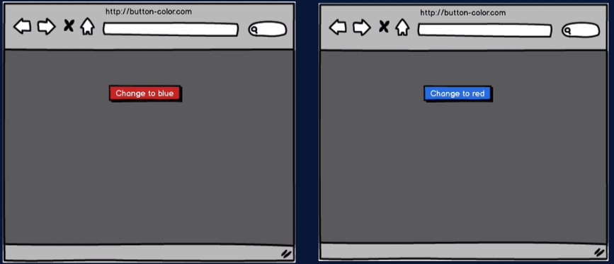

# Color Button APP
Esse aplicativo foi desenvolvido no curso da udemy a seguir estão a descrição do passo a passo utilizado no desenvolvimento do aplicativo e na sua testagem.

## Começando o App Color Button

Vamos criar um aplicativo muito simples que ajudará a nos acostumar com os testes. O aplicativo será chamado Color Button. 

Aqui está o plano para este aplicativo incrivelmente inovador!

- A cor inicial do botão será vermelha e o texto mostrado na tela será *“Change to Blue”* indicando que ao clicar no botão, ele mudará para azul.
- Então, quando o botão mudar para azul, ele terá o texto alterado para vermelho, indicando que quando você clicar nele, ele mudará novamente para vermelho.



Então, no verdadeiro estilo do TDD, escreveremos nossos testes antes de realmente codificar a funcionalidade. Vamos começar a escrever o que queremos testar.

Então, **o que queremos testar?** Vamos testar se o botão tem a cor inicial correta. Após o primeiro testa nos vamos testar também se o botão tem o texto inicial correto. Por fim, nos vamos realmente testar a funcionalidade do botão que quando você clica nele, fica azul.

A primeira coisa que sempre faremos é renderizar e, neste caso, é muito óbvio o que queremos renderizar. Queremos renderizar o componente App.

```jsx
test('button has correct initial color', () => {
	render(<App />)
})
```

A próxima coisa que temos a fazer é encontrar o elemento que nos interessa, e para isso vamos usar o objeto global `screen` que tem acesso ao DOM virtual criado pelo `render()`.

Vamos utilizar o métido `getByRole()`. Esse é sempre o método preferido para garantir que seu aplicativo seja acessível, o termo *role* referece a função que os elementos de sua página possuem e o que estamos trabalhando agora tem uma função de *button* (botão). Se você não tem certeza sobre as funções dos elementos em sua DOM, sempre pode acessar o site do [W3C](https://www.w3.org/TR/wai-aria-1.1/#role_definitions) para ver quais são as opções.

Vou usar esse objeto global `screen`, vou usar o método `getByRole()`. O primeiro argumento será uma *string* representando a função neste caso *button*. E o segundo argumento, usaremos a opção de nome e o nome que esperamos. Vamos esperar que o nome, que no nosso caso é o texto de exibição, seja ‘Change to blue’.

```jsx
test('button has correct initial color', () => {
	render(<App />)
	
	// find an element with a role of button and text of 'Change to blue' 
	const colorButton = screen.getByRole('button', { name: 'Change to blue' })
})
```

Portanto, nossa *assertion* começará com uma expectativa, como todas as *assertion* e o objeto de nossa *assertion* é um botão colorido.

Em seguida, usaremos esse *matcher* personalizado para ter *Style* e o argumento de estilo que forneceremos é *backgroundcolor* e esperamos ser vermelho.

```jsx
test('button has correct initial color', () => {
	render(<App />)
	
	// find an element with a role of button and text of 'Change to blue' 
	const colorButton = screen.getByRole('button', { name: 'Change to blue' })

	// expect the background color to be red
	expect(colorButton).toHaveStyle({ backgroundColor: 'red' })

})
```

Fizemos com sucesso a parte vermelha do nosso teste vermelho-verde (red-green testing).

Então, dentro da div do componente App... vamos fazer um botão e vamos dar-lhe um estilo.

```jsx
import './App.css';

function App() {
  return (
    <div className="App">
      <button style={{backgroundColor: 'red'}}>Change to blue</button>
    </div>
  );
}

export default App;
```

E nosso teste está passando!, então parabéns a você. temos nosso primeiro teste verde vermelho.

## Teste que encontra botão (button) e clica

Vamos falar sobre nosso próximo teste, que é onde vamos realmente interagir com a DOM. O objetivo agora é **clicar** no botão e  verificar se ele fica azul.

Então, como de costume, nosso primeiro passo será renderizar o componente. Então precisamos encontrar o elemento, exatamente da mesma forma que fizemos antes, vamos usar o `getByRole(...)` e vamos dar um nome 'Change to blue'.

```jsx
test('button turn blue when clicked', () => {

	render(<App />)
	const colorButton = screen.getByRole('button', { name : 'Change to blue' })
})
```

Primeiro esperamos que a cor de fundo seja vermelha e clicaremos no botão, que já encontramos. Então, como esse botão é clicado? Vamos importar outro objeto da biblioteca de testes react e este será `fireEvent`. É isso que vai nos ajudar a interagir com os elementos em nosso DOM virtual.

```jsx
test('button turn blue when clicked', () => {
  render(<App />)

  // find an element with a role of button and test of 'Change to blue'
  const colorButton = screen.getByRole('button', { name: 'Change to blue' })

  
  // expect the background color to be red
  expect(colorButton).toHaveStyle({ backgroundColor: 'red'})
  
  // click button
  fireEvent.click(colorButton)

})
```

Ok, isso foi fácil, clicamos no botão e o que esperamos que aconteça depois que o botão for clicado? Espera-se que tenhamos uma cor de fundo azul?


```jsx
test('button turn blue when clicked', () => {
  render(<App />)

  // find an element with a role of button and test of 'Change to blue'
  const colorButton = screen.getByRole('button', { name: 'Change to blue' })

  
  // expect the background color to be red
  expect(colorButton).toHaveStyle({ backgroundColor: 'red'})
  
  // click button
  fireEvent.click(colorButton)

  // expect the background color to be blue
  expect(colorButton).toHaveStyle({ backgroundColor: 'blue' })

  // expect the button text to be 'Change to red'
  expect(colorButton.textContent).toBe('Change to red')

})
```

Para nosso teste passar nosso componente `App` deve ser:
```jsx
import { useState } from 'react'

function App() {
  const [buttonColor, setButtonColor] = useState('red')
  const newButtonColor = buttonColor === 'red' ? 'blue' : 'red'
  return (
    <div>
        <button 
          style={{backgroundColor: buttonColor }}
          onClick={()=>setButtonColor(newButtonColor)}
        >
          Change to {newButtonColor}</button>
    </div>
  );
}

export default App;
```